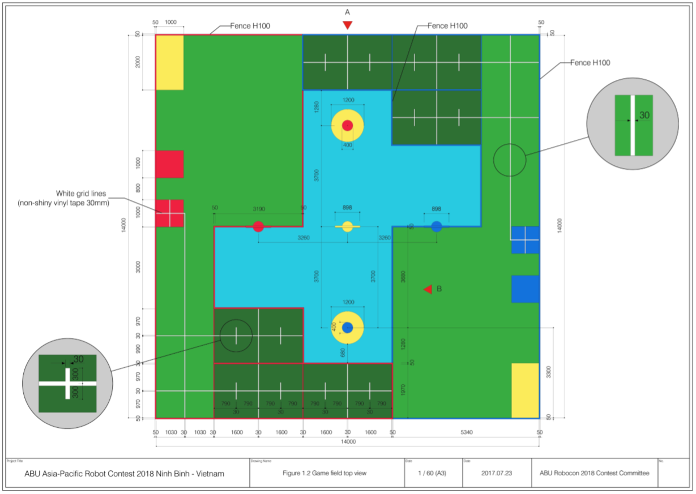

# Robocon 2018: Line Following Robot

This is the sample of the code which was used in the line following system for the automatic robot in Robocon 2018.

## About the competition

The automatic robot is supposed to start from either red or blue starting zone. It must follow the line to move to the three throwing zones one-by-one. The automatic bot will be given a shuttle by a manual robot, which will be thrown through two rings.

When the automatic robot reaches the third throwing zone, it has to throw a shuttle through the golden ring and land in the cup, kept on the other side, to win the round. A total of 5 throws are available through golden ring. If the bot fails to land the shuttle inside the cup, it can continue throwing from throwing zone 1 or 2 until time runs out.

The dark green region can only be accessed by automatic bot, while the light green area is accessible by both - automatic and manual bot. The cross-section right before the Automatic Robot Zone is the loading point, where the shuttle is handed by the manual bot. Details of the arena are shown below.

## Line following system (LFS)

The following components were used in building the LFS of automatic bot:
* Arduino Mega microcontroller
* Advanced Auto-Calibrating Line Sensor LSA08
* Dual DC Motor Driver 20A [RKI-1341] 
* Omni wheels (set of 4)
* Servo
